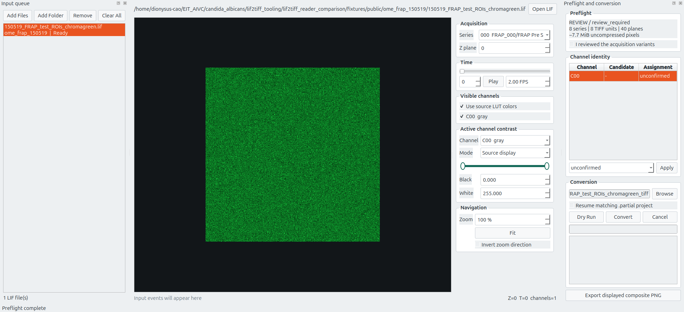

[English](README.md) | [中文](README_zh.md)

# LIF2TIFF

LIF2TIFF is a Leica LIF inspection, visualization, conversion, and validation
workbench for life-science imaging. It treats each LIF file as one input unit,
keeps source files read-only, and writes portable TIFF projects with relative
paths and machine-readable metadata.



## Downloads

GitHub Releases provide two native packages:

- `LIF2TIFF-Linux-x86_64-v2.0.0-beta.1.tar.gz`
- `LIF2TIFF-Windows-x64-v2.0.0-beta.1.zip`

Each package contains a desktop GUI and a terminal CLI. No Python installation
is required for downloaded packages.

## Main capabilities

- Drag one or many LIF files, or folders containing LIF files, into the GUI.
- Preview 2D, Z, T, and ZT acquisitions without converting them first.
- Inspect source LUT colors and per-channel display ranges without modifying
  the LIF.
- Navigate, zoom, pan, play time series, and inspect interactive stage maps.
- Inspect per-Series recorded acquisition properties, including timestamps,
  objective, scan settings, and channel-specific laser/detector parameters.
- Infer channel identity from acquisition metadata and require explicit user
  confirmation before conversion.
- Load an optional project-specific protocol registry from the user's config
  directory without embedding private acquisition evidence in the public app.
- Run metadata-only Dry Run and storage preflight for one or many LIF files.
- Convert to relocatable TIFF projects with cancellation and validated resume.
- Validate output metadata, file hashes, TIFF structure, and optionally exact
  source pixels.
- Export presentation images for individual channels or channel overlays.

## GUI

From source on Linux:

```bash
python -m venv .venv
source .venv/bin/activate
pip install -r requirements.txt
./run_gui.sh
```

## CLI

From source:

```bash
./run_cli.sh --help
./run_cli.sh inspect INPUT.lif
./run_cli.sh channels INPUT.lif
./run_cli.sh plan INPUT.lif
./run_cli.sh convert INPUT.lif --ask-channel-roles
./run_cli.sh validate INPUT_tiff --source INPUT.lif
```

Downloaded packages provide `lif2tiff` on Linux and `lif2tiff.exe` on Windows.
PowerShell example:

```powershell
.\lif2tiff.exe plan "D:\data\experiment.lif"
```

## Safety model

- Original LIF files are opened read-only.
- Existing complete outputs are never overwritten.
- Incomplete work is written to a `.partial` project.
- Manifests store relative paths and source filenames, not machine-specific
  absolute paths.
- Inferred dye identity is separate from user-confirmed identity.
- A non-standard acquisition is routed through an explicit review workflow.

## Tests and development evidence

The repository retains reproducible engineering evidence without publishing
original experimental LIF files:

- automated unit and edge-case tests in `tests/`;
- synthetic malformed and naming-collision fixtures;
- selected public-fixture conversion outputs and machine-readable audit data;
- acceptance reports and representative GUI screenshots;
- the original v1 implementation in `legacy/readlif-v1/` and Git history.

See [testing documentation](docs/testing/README.md) and
[development history](docs/history/README.md).

## Documentation

- [Product guide](docs/product-guide.md)
- [Manifest schema](docs/manifest-schema.md)
- [Channel identity model](docs/channel-identity.md)
- [Private registry configuration](docs/private-registry.md)
- [Release notes](RELEASE_NOTES.md)
- [Third-party notices](THIRD_PARTY_NOTICES.md)

## Scope

LIF2TIFF is not a replacement for Leica LAS X acquisition control or advanced
3D volume rendering. Channel identity is an acquisition-parameter inference,
not proof of the dye physically added to a sample.

Recorded Leica FILETIME values are interpreted as UTC instants and displayed
in the current instrument deployment timezone (UTC+8). Configurable display
timezones remain future work for deployments in other regions.

## License

MIT. Bundled dependencies retain their own licenses; see
`THIRD_PARTY_NOTICES.md`.
